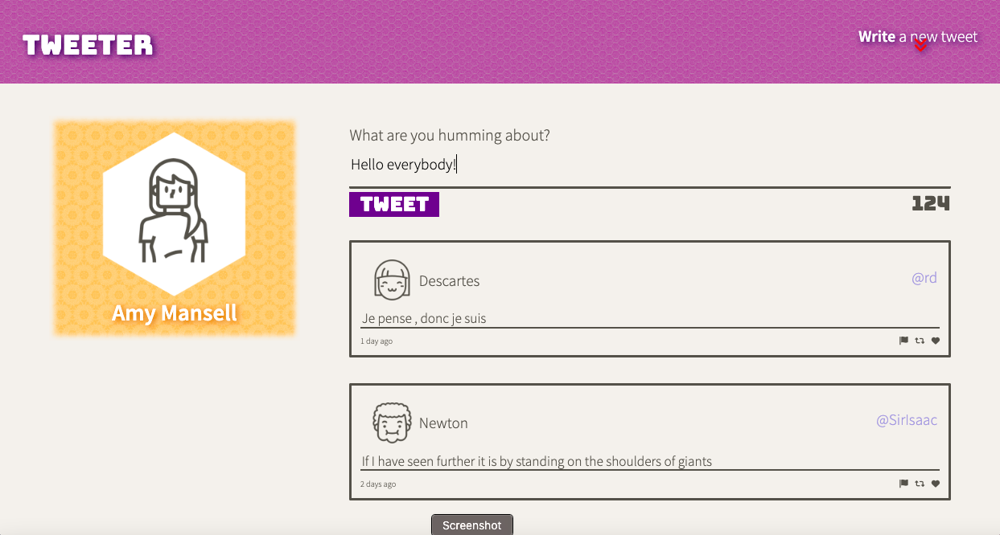
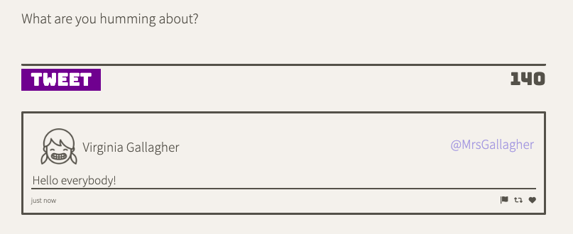
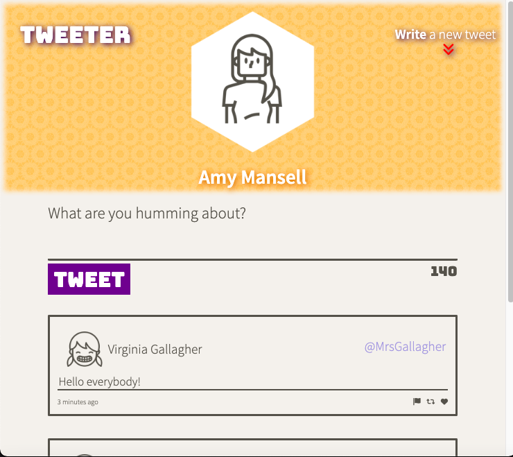
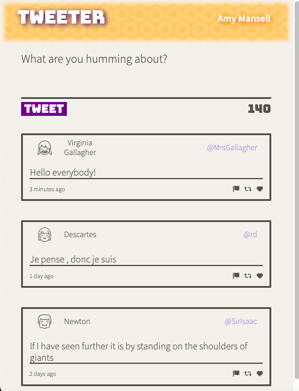

# Tweeter Project

Tweeter is a simple, single-page Twitter clone.

## Final Product

***
Here we can see the Main page:

***
Here we have the main page on the desktop:

***

Want to write something and show the world? (Just type in something into the form):

***
Here you can see submitted tweet:

***
Here's how app looks like on a tablet:

***
Here's how app looks like on a mobile device:

ENJOY!

## Dependencies
  ***
  -body-parser
  ***
  -chance
  ***
  -express
  ***
  -md5
  ***
  -timeago.js
  ***

## Getting Started

- Install all dependencies (using the `npm install` command).
- Run the server using the `npm run local` command.
- Go to 'localhost:8080' and enjoy the app!